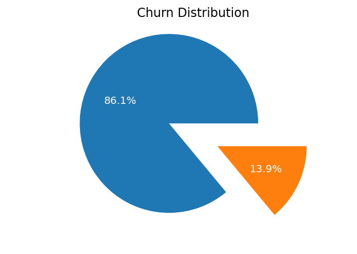
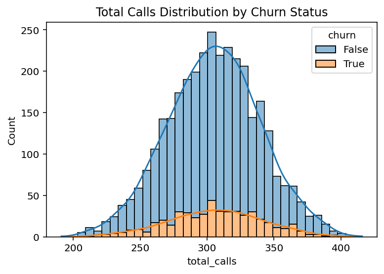
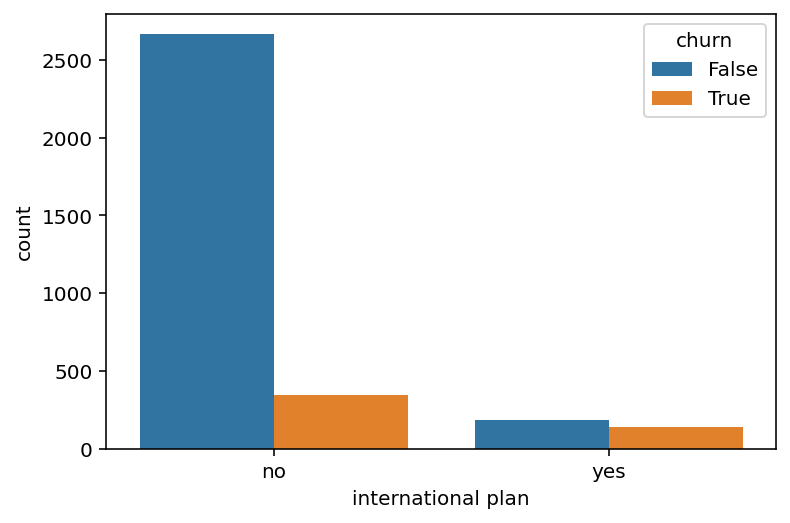
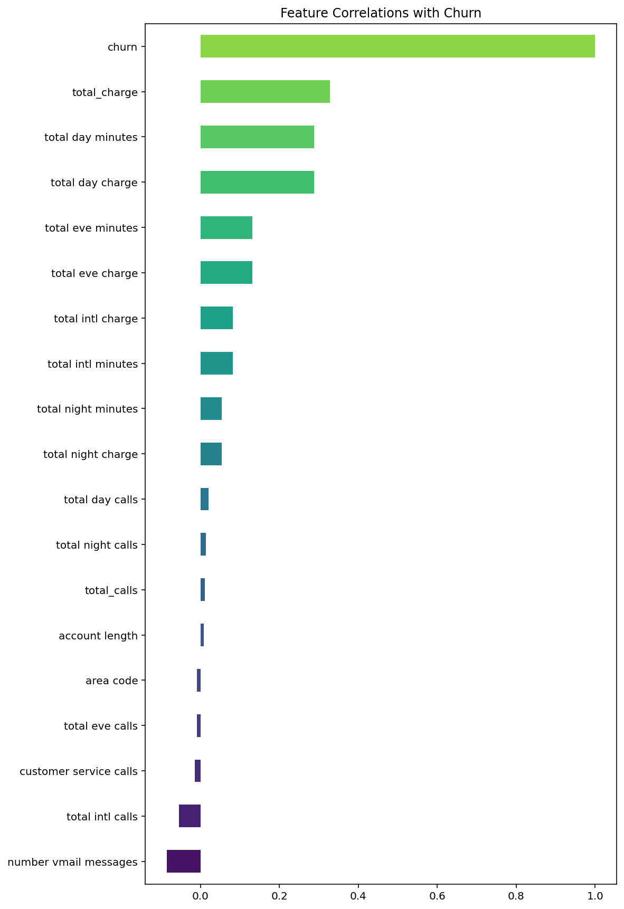
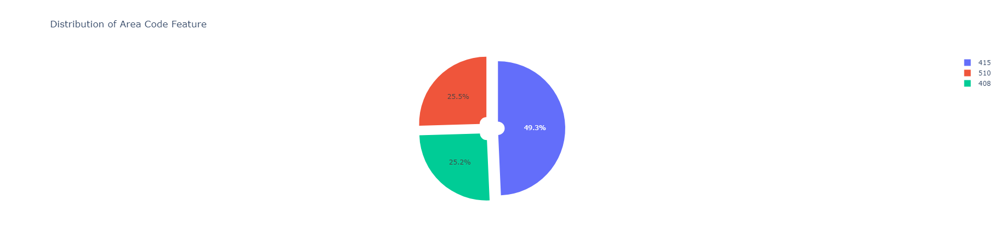
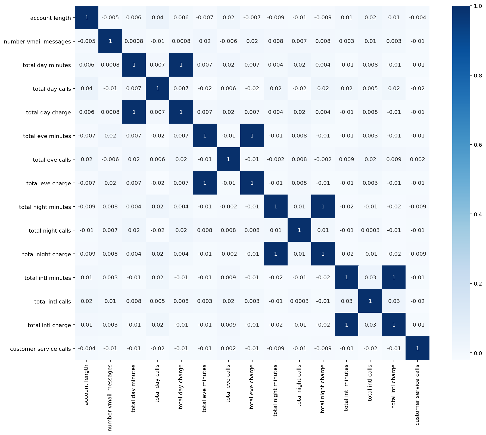
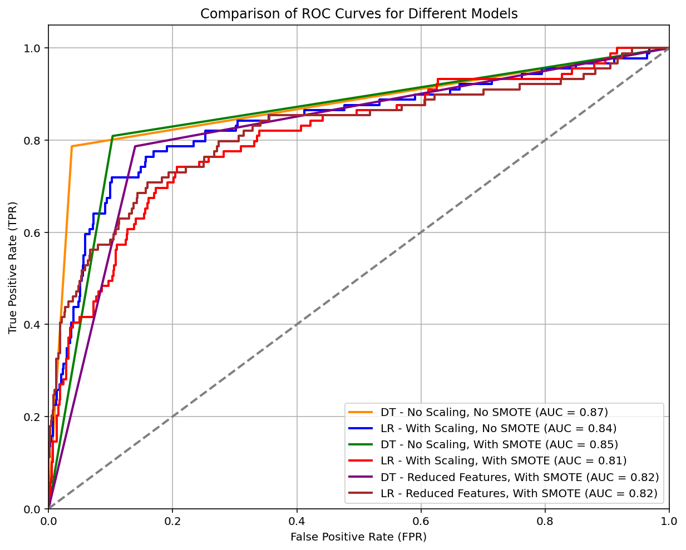
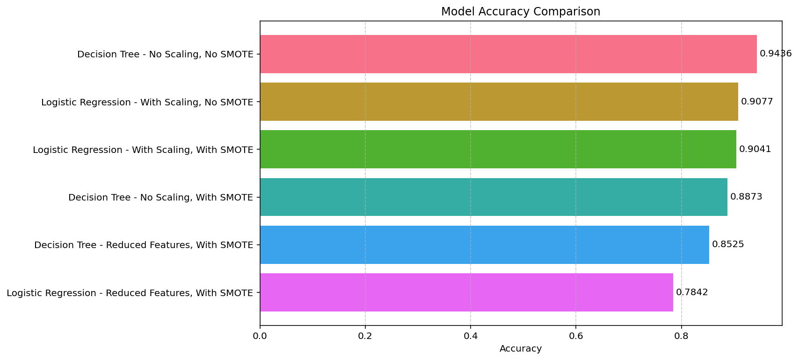

# SyriaTel Customer Churn Prediction

## Overview

Customer churn, where customers stop using Syriatel's services, is a significant issue, with the telecom industry facing average churn rates between 30% to 35%. Retaining existing customers is more cost-effective than acquiring new ones, making churn prediction crucial for sustaining business growth. This project aims to equip Syriatel with a robust predictive model to identify high-risk customers and tailor retention strategies accordingly.

Stakeholders:

Syriatel Management: To strategize and implement customer retention programs.

Customer Service Teams: To identify and engage with high-risk customers effectively.

Data Analysts: To continuously monitor and refine the model for better accuracy.

**Author**: Geoffrey Mwangi

## Dataset Overview

### Data Understanding

The dataset utilized in this project originates from Syriatel, containing detailed information about the company's customers. Each record corresponds to a unique customer, with attributes that provide insights into their interaction with Syriatel's services. These attributes include demographic information, service usage patterns, and customer engagement metrics, all of which are crucial for understanding and predicting customer churn.

**Data Source and Suitability:**
The dataset is well-suited for the objective of predicting customer churn, as it includes both behavioral and service-related features that are likely to influence a customer's decision to terminate their contract. By analyzing these features, the model can identify patterns and correlations that contribute to churn, enabling targeted retention strategies.

**Dataset Size and Descriptive Statistics:**
- The dataset includes 3333 rows and 21 columns, representing a substantial amount of data for robust analysis.
- **Key Features and Descriptive Statistics:**
  - **State:** The state where the customer resides. This categorical variable can help identify geographic patterns in churn.
  - **Account Length:** The number of days the customer has had this account. Longer account durations might correlate with customer loyalty.
  - **Area Code:** The area code associated with the customer's phone number. This categorical variable could influence service usage patterns.
  - **Phone Number:** The customer's phone number. This feature is excluded from the analysis as it is not relevant for predicting churn.
  - **International Plan:** Indicates whether the customer has subscribed to an international calling plan (binary: True/False). This feature might impact customer satisfaction and churn rates.
  - **Voice Mail Plan:** Indicates whether the customer has subscribed to a voicemail plan (binary: True/False). This feature could also influence customer satisfaction and churn.
  - **Number Vmail Messages:** The number of voicemail messages the customer has received. This numerical variable might indicate how much the customer relies on voicemail services.
  - **Total Day Minutes:** The total number of minutes the customer has spent on calls during the day. Higher usage could be an indicator of engagement with the service.
  - **Total Day Calls:** The total number of calls the customer has made during the day. This metric, like total day minutes, provides insight into customer engagement.
  - **Total Day Charge:** The total charges incurred by the customer for daytime calls. This feature is directly related to revenue and could affect satisfaction.
  - **Total Eve Minutes:** The total number of minutes the customer has spent on calls during the evening. Evening usage patterns might differ from daytime patterns and affect churn.
  - **Total Eve Calls:** The total number of calls the customer has made during the evening. Like total eve minutes, this provides additional insight into customer behavior.
  - **Total Eve Charge:** The total charges incurred by the customer for evening calls. This feature, like total day charge, is related to revenue and customer satisfaction.
  - **Total Night Minutes:** The total number of minutes the customer has spent on calls during the night. Nighttime usage might reflect different customer needs or behaviors.
  - **Total Night Calls:** The total number of calls the customer has made during the night. This metric, together with total night minutes, provides a complete picture of the customer’s usage patterns.
  - **Total Night Charge:** The total charges incurred by the customer for nighttime calls. This is another revenue-related feature that could influence satisfaction and churn.
  - **Total Intl Minutes:** The total number of minutes the customer has spent on international calls. This metric could be particularly relevant for customers with an international plan.
  - **Total Intl Calls:** The total number of international calls the customer has made. This could indicate how valuable the international plan is to the customer.
  - **Total Intl Charge:** The total charges incurred by the customer for international calls. This feature might significantly influence churn, especially for international callers.
  - **Customer Service Calls:** The number of times the customer has called customer service. High values might indicate dissatisfaction and be a strong predictor of churn.
  - **Churn:** The target variable, indicating whether the customer has terminated the contract (binary: True/False).

**Feature Relevance:**
Each feature included in the dataset has been selected based on its potential relevance to customer churn. For instance, service usage patterns (e.g., total minutes and charges) and customer service interactions are directly linked to customer satisfaction, which is a strong predictor of churn. The inclusion of these features allows the model to capture a comprehensive view of customer behavior.

**Data Limitations:**
- **Lack of Demographic Data:** While the dataset includes the state and area code, more granular demographic data such as age, income, or occupation could provide deeper insights into churn behavior.
- **Potential Class Imbalance:** The dataset may have an imbalance between the number of churned and non-churned customers, which could impact model performance and necessitate techniques like SMOTE (Synthetic Minority Over-sampling Technique).
- **Temporal Aspects:** The dataset does not include time-based variables that could reveal trends or shifts in customer behavior over time, limiting the ability to detect seasonality or changes in churn patterns.

These limitations, while significant, do not outweigh the strengths of the dataset. The comprehensive nature of the included features still provides a solid foundation for building effective predictive models aimed at reducing customer churn for Syriatel.

## Data Preprocessing

Data Cleaning

In this section, we prepare the data for exploratory data analysis (EDA) and modeling. The following checks are performed:

- **Duplicated Rows**: Identifying and removing any duplicate entries.
- **Missing Values**: Detecting and addressing any gaps in the data.
- **Irrelevant Columns**: Removing columns that do not contribute to the analysis.

### Feature Types

* This step seperates all of the useful features in the dataset so that they can be analyzed accordingly ahead of modeling.  

#### Continuous Features:
* account length
* number vmail messages
* total day minutes
* total day calls
* total day charge
* total eve minutes
* total eve calls
* total eve charge
* total night minutes 
* total night calls
* total night charge
* total intl minutes
* total intl charge
* customer service calls

#### Categorical Features:
* state
* area code
* international plan
* voicemail plan

### Encoding Categorical Features

Categorical features were encoded using `LabelEncoder` and `OneHotEncoder` to convert them into a format suitable for machine learning models. This step was crucial for ensuring that the categorical data could be effectively used in the models.

### Data Normalization

Numerical features were normalized using `MinMaxScaler` to ensure that they were on the same scale, which is particularly important for models like SVM and K-Nearest Neighbors.

## Exploratory Data Analysis (EDA)

### Visualizations

### Churn vs Did not Churn representation

Total Calls Distribution by Churn Status

Conclusion

**Non-Churned Users:**

The distribution of total calls for users who did not churn (churn = False) is symmetric and follows a normal distribution centered around 300 calls.

The spread of calls is quite wide, ranging from about 200 to 400 calls.

**Churned Users:**

For users who churned (churn = True), the distribution is also symmetric but with a lower center around 250 calls.

The distribution is narrower, suggesting that churned users tend to have fewer total calls compared to non-churned users.

International plan vs churn

Conclusion :

Customers without an international plan are much more likely to stay (not churn) compared to those with an international plan. Additionally, the proportion of customers who churn is relatively higher among those with an international plan compared to those without one.

Features Correlations with Churn

Distribution of Area Code Feature

* Half of the customers have the area code 415. 
* One fourth of customers have the area code 510 and another fourth have the area code 408.

Correlation Heatmap for Numeric Features

**Positive Correlations**: Features like customer service calls, total day minutes, and total day charge show a positive correlation with churn, indicating that higher usage in these areas is associated with a higher likelihood of customer churn.

**Negative Correlations**: Features such as number vmail messages and total intl calls show a negative correlation with churn, suggesting that higher usage in these areas might reduce the likelihood of churn.

**Weak or Negligible Correlations**: Several features like total night calls and account length have little to no correlation with churn, indicating minimal influence on the likelihood of a customer churning.

### Insights
Average Values of Numerical Features for Churned Users

The following table represents the average (mean) values of numerical features for users who have churned:

- **Account Length**: The average length of time that churned users had their accounts is about **102.66** days.
- **Area Code**: The average area code for churned users is **437.82**. (Note: Area codes are categorical, so this value is less meaningful).
- **Number of Voicemail Messages**: On average, churned users had about **5.12** voicemail messages.
- **Total Day Minutes**: Churned users spent an average of **206.91** minutes on daytime calls.
- **Total Day Calls**: The average number of daytime calls made by churned users is **101.34**.
- **Total Day Charge**: Churned users were charged an average of **$35.18** for daytime calls.
- **Total Evening Minutes**: On average, churned users spent **212.41** minutes on evening calls.
- **Total Evening Calls**: The average number of evening calls made by churned users is **100.56**.
- **Total Evening Charge**: Churned users were charged an average of **$18.05** for evening calls.
- **Total Night Minutes**: The average night minutes for churned users is **205.23** minutes.
- **Total Night Calls**: Churned users made an average of **100.40** night calls.
- **Total Night Charge**: Churned users were charged an average of **$9.24** for night calls.
- **Total International Minutes**: Churned users spent an average of **10.70** minutes on international calls.
- **Total International Calls**: The average number of international calls made by churned users is **4.16**.
- **Total International Charge**: Churned users were charged an average of **$2.89** for international calls.
- **Customer Service Calls**: On average, churned users made **2.23** calls to customer service.

This summary provides insight into the usage patterns and characteristics of customers who decided to leave the service.

## Feature Engineering
Feature Reduction with Feature Importances

By selecting the most important features, we reduce the dimensionality of the dataset. This will lead to simpler models that are potentially more generalizable, and also reduces the risk of overfitting.

## Evaluating and Comparing the different  Models

Decision Tree - No Scaling, No SMOTE:
Confusion Matrix:
[[717  28]
 [ 19  70]]

Classification Report:
              precision    recall  f1-score     support
0              0.974185  0.962416  0.968265  745.000000
1              0.714286  0.786517  0.748663   89.000000
accuracy       0.943645  0.943645  0.943645    0.943645
macro avg      0.844235  0.874466  0.858464  834.000000
weighted avg   0.946450  0.943645  0.944830  834.000000
-*--*--*--*--*--*--*--*--*--*--*--*--*--*--*--*--*--*--*--*--*--*--*--*--*--*--*--*--*--*-

Logistic Regression - With Scaling, No SMOTE:
Confusion Matrix:
[[737   8]
 [ 69  20]]

Classification Report:
              precision    recall  f1-score     support
0              0.914392  0.989262  0.950355  745.000000
1              0.714286  0.224719  0.341880   89.000000
accuracy       0.907674  0.907674  0.907674    0.907674
macro avg      0.814339  0.606990  0.646117  834.000000
weighted avg   0.893038  0.907674  0.885422  834.000000
-*--*--*--*--*--*--*--*--*--*--*--*--*--*--*--*--*--*--*--*--*--*--*--*--*--*--*--*--*--*-

Decision Tree - No Scaling, With SMOTE:
Confusion Matrix:
[[668  77]
 [ 17  72]]

Classification Report:
              precision    recall  f1-score    support
0              0.975182  0.896644  0.934266  745.00000
1              0.483221  0.808989  0.605042   89.00000
accuracy       0.887290  0.887290  0.887290    0.88729
macro avg      0.729202  0.852817  0.769654  834.00000
weighted avg   0.922683  0.887290  0.899133  834.00000
-*--*--*--*--*--*--*--*--*--*--*--*--*--*--*--*--*--*--*--*--*--*--*--*--*--*--*--*--*--*-

Logistic Regression - With Scaling, With SMOTE:
Confusion Matrix:
[[719  26]
 [ 54  35]]

Classification Report:
              precision    recall  f1-score     support
0              0.930142  0.965101  0.947299  745.000000
1              0.573770  0.393258  0.466667   89.000000
accuracy       0.904077  0.904077  0.904077    0.904077
macro avg      0.751956  0.679180  0.706983  834.000000
weighted avg   0.892112  0.904077  0.896009  834.000000
-*--*--*--*--*--*--*--*--*--*--*--*--*--*--*--*--*--*--*--*--*--*--*--*--*--*--*--*--*--*-

Decision Tree - Reduced Features, With SMOTE:
Confusion Matrix:
[[641 104]
 [ 19  70]]

Classification Report:
              precision    recall  f1-score     support
0              0.971212  0.860403  0.912456  745.000000
1              0.402299  0.786517  0.532319   89.000000
accuracy       0.852518  0.852518  0.852518    0.852518
macro avg      0.686755  0.823460  0.722387  834.000000
weighted avg   0.910501  0.852518  0.871889  834.000000
-*--*--*--*--*--*--*--*--*--*--*--*--*--*--*--*--*--*--*--*--*--*--*--*--*--*--*--*--*--*-

Logistic Regression - Reduced Features, With SMOTE:
Confusion Matrix:
[[589 156]
 [ 24  65]]

Classification Report:
              precision    recall  f1-score     support
0              0.960848  0.790604  0.867452  745.000000
1              0.294118  0.730337  0.419355   89.000000
accuracy       0.784173  0.784173  0.784173    0.784173
macro avg      0.627483  0.760471  0.643403  834.000000
weighted avg   0.889698  0.784173  0.819634  834.000000
-*--*--*--*--*--*--*--*--*--*--*--*--*--*--*--*--*--*--*--*--*--*--*--*--*--*--*--*--*--*-

### Comparison of ROC Curves for Different Models

### Model Accuracy Comparison

**Conclusion**: 

## Feature Importance

## Conclusion and Recommendations

### Business Implications

### Future Work

